# Generative Modeling via Drifting
Deng et al. 2026

     

Reviewed & Presented by Joon Hyeok Kim

---

# Key Takeaways

### 1. (Claimed by the Authors) New paradigm of training
- Pros
  - 1-NFE evaluation with competitive quality
  - Simple Loss Construction
- Cons
  - Relies on batch normalization (Info NCE)
    - which also means that there's a room for improvement?

### 2. (Suggested) New possibilities for Normalizing Flow?

---

# Concept 1) Push Forward
## Def.) Given the distributions $p$ and $q$, and a model $f$, 
## $\quad\quad$ we say $q$ is a **pushforward distribution** of $p$ under $f$ 
## $\quad\quad\quad\quad$ if $f(\epsilon)=\mathbf{x} \sim q$ for $\epsilon\sim p$.
## $\quad\quad$ We denote $q=f_{\#} p$.

 

## Then, we want to find $f_\theta$ s.t. $p_{\text{data}} = {f_\theta}_\# p_{\text{prior}}$

---

## Now, denote $\epsilon\sim p_\epsilon$, and assume training the model $f_\theta$.
## After some iterative steps, we may be at the $i$-th step.
## Then, we may have a sequence of **pushforward distributions** $\{f_i\}$
## $\quad$ where $\mathbf{x}_{i} = f_i(\epsilon) \sim q_i$

 

## How can we define a relation between $f_i$s?

---

# Concept 2) Drift & Drifting Field
## Now consider $\mathbf{x}_{i+1}=f_{i+1}(\epsilon)\sim q_{i+1}$ and $\mathbf{x}_{i} = f_{i}(\epsilon)\sim q_{i}$.
## We may define the **drift** as $\Delta\mathbf{x}_{i+1}=\mathbf{x}_{i+1}-\mathbf{x}_{i}$.

 

## Further, we may define a **drifting field** of $\mathbf{V}_{p,q}$ as
## $\quad \mathbf{V}_{p,q_i} : \mathbb{R}^d\rightarrow\mathbb{R}^d\;$ s.t. $\;\mathbf{x}_{i+1} = \mathbf{x}_{i}+\mathbf{V}_{p,q_i}(\mathbf{x}_{i})$
## $\quad\quad$ where $p=p_{\text{data}}$ and $\mathbf{x}_i=f_i(\epsilon)\sim q_i$

#### Then what would be the **convergence** condition? (i.e., **no more drift**)

---

## Obviously, $\mathbf{V}_{p,q} = \mathbf{0}$.
## Among many candidates for $\mathbf{V}_{p,q}$, authors suggest the **anti-symmetric** drifting field that satisfies
## $\quad\quad \mathbf{V}_{p,q}(\mathbf{x}) = -\mathbf{V}_{q,p}(\mathbf{x}),\quad \forall\mathbf{x}\in\mathbb{R}^d$

#### Why?)
#### $\quad$ If $p=q\; (\Leftrightarrow p_{\text{data}}=p_{\text{model}}: \text{what we want!})$, 
#### $\quad\quad$ then $\mathbf{V}_{p,q}(\mathbf{x})=\mathbf{V}_{q,p}(\mathbf{x})\Rightarrow \mathbf{V}_{p,q}(\mathbf{x})=0$ 
#### $\quad$ Authors further show that their **Softmax** method satisfies the **converse**, 
#### $\quad\quad$ i.e. $\mathbf{V}_{p,q}(\mathbf{x})=0 \Rightarrow p=q\quad$ (Refer to Appendix C.1 for more details) 

---

### Assuming that there is a method that satisfies "$\mathbf{V}_{p,q}(\mathbf{x})=0 \Rightarrow p=q$", optimizing the following objective is equivalent to training $f$ to pushforward $p$ to $q$.

 

# Training Objective
### $\quad\quad\mathcal{L} = \mathbb{E}_{\boldsymbol{\epsilon}}\bigg[ \Big\Vert \underbrace{f_\theta(\boldsymbol{\epsilon})}_{\text{prediction}} - \underbrace{\text{stop\_grad}(f_\theta(\boldsymbol{\epsilon}) + \mathbf{V}_{p,q}(f_\theta(\boldsymbol{\epsilon})))}_{\text{frozen target}} \Big\Vert^2 \bigg]$

 

### Only if we have $\mathbf{V}$ that satisfies $\mathbf{V}_{p,q}(\mathbf{x})=0 \Rightarrow p=q$

---

# Kernel & Info NCE (Softmax)
We want to find $\mathbf{V}$ s.t. $\mathbf{V}_{p,q}(\mathbf{x})=0 \Rightarrow p=q$

### Use a kernel function $\mathbf{k}(\cdot, \cdot)$ to get the positive/negative drift field of
### $\quad\begin{cases} \mathbf{V}_p^+(\mathbf{x}):= \displaystyle\frac{\mathbb{E}_p\left[\mathbf{k}(\mathbf{x}, \mathbf{y^+})(\mathbf{y^+}-\mathbf{x})\right]}{Z_p} \\ \mathbf{V}_q^-(\mathbf{x}):= \displaystyle\frac{\mathbb{E}_q\left[\mathbf{k}(\mathbf{x}, \mathbf{y^-})(\mathbf{y^-}-\mathbf{x})\right]}{Z_q} \end{cases}\quad\text{for }\begin{cases} Z_p(\mathbf{x}) := \mathbb{E}_p[\mathbf{k}(\mathbf{x}, \mathbf{y^+})] \\\\ Z_q(\mathbf{x}) := \mathbb{E}_q[\mathbf{k}(\mathbf{x}, \mathbf{y^-})] \end{cases}$

---

### Then adding two drift fields, we may get
### $\begin{aligned}  \mathbf{V}_{p,q}(\mathbf{x}) &= \mathbf{V}_p^+(\mathbf{x}) - \mathbf{V}_q^-(\mathbf{x}) \\ &= \displaystyle\frac{1}{Z_pZ_q}\mathbb{E}_{p,q}\left[\mathbf{k}(\mathbf{x}, \mathbf{y^+})\mathbf{k}(\mathbf{x}, \mathbf{y^-})(\mathbf{y^+}-\mathbf{y^-})\right]  \end{aligned}$

 

### Following the Info NCE, the above $\mathbf{k}(\mathbf{x}, \mathbf{y})$ is implemented using the **Softmax** function where the logit is given by $-\frac{1}{\tau}\big\Vert\mathbf{x}-\mathbf{y}\big\Vert$

#### cf.) $\mathcal{L} = -\mathbb{E}\left[\log\frac{\sum_{\mathbf{y}^+\in\mathcal{Y}^+}f(\mathbf{y}^+, \mathbf{x})}{\sum_{\mathbf{y}\in\mathcal{Y}^+\cup\mathcal{Y}^-}f(\mathbf{y}, \mathbf{x})}\right]$
#### Refer to Oord et al. 2019, *"Representation Learning with Contrastive Predictive Coding"* for more details.

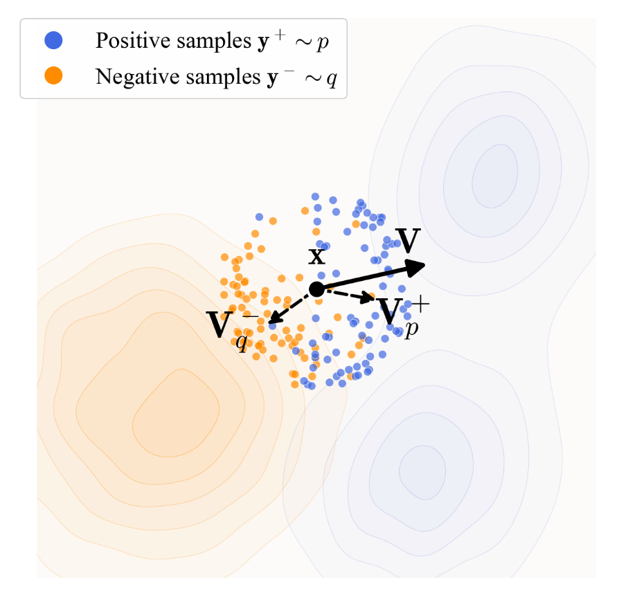

---

# Implementation Details
### - Backbone : $f = \text{DiT}$
### - Masked Autoencoder (**MAE**) is used for the Imagenet dataset
### $\quad$ (Successful on the Pixel-space generation as well.)
### - **CFG** is used : $p_{\text{data}}(\cdot\mid\emptyset)$ is added to the negative sample pool

### **[Training Pipeline]**
$\begin{aligned}
  \epsilon\sim\mathcal{N} &\rightarrow \text{MAE}(f(\epsilon)) = \mathbf{y}^- 
  \\ \mathbf{x}\sim p_{\text{data}} &\rightarrow  \text{MAE}(\mathbf{x}) = \mathbf{y}^+
\end{aligned}\;\rightarrow\;\text{Softmax}\left(\frac{-\Vert\mathbf{x}-\mathbf{y}\Vert}{\tau}\right)_{\mathbf{y}=\mathbf{y}^-,\mathbf{y}^+} \approx\mathcal{K}(\mathbf{x}, \mathbf{y}^-, \mathbf{y}^+)$

$\quad\quad\quad\quad\quad\quad\quad\rightarrow\mathbf{V}_{p,q}\rightarrow \mathcal{L} = \mathbb{E}_{\boldsymbol{\epsilon}}\bigg[ \Big\Vert \underbrace{f_\theta(\boldsymbol{\epsilon})}_{\text{prediction}} - \underbrace{\text{stop\_grad}(f_\theta(\boldsymbol{\epsilon}) + \mathbf{V}_{p,q}(f_\theta(\boldsymbol{\epsilon})))}_{\text{frozen target}} \Big\Vert^2 \bigg]$

---

# Experiments
### 2D Toy Example : Bimodal Distribution
- Result
  - Successful and robust to mode collapse 
    - Why?) Each mode attracts and push samples to each other

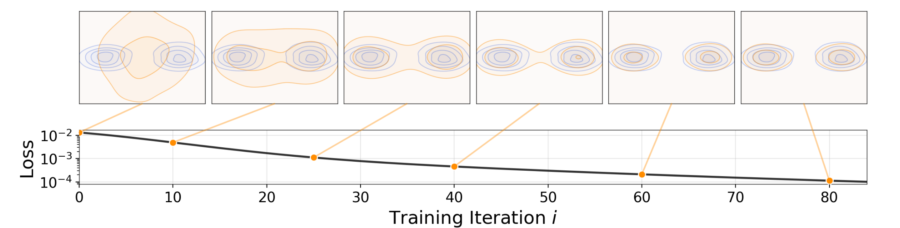

---

## Robustness to Mode Collapse

### Case 3
### Model distribution $q$ initialized as the **unimodal** and **mode collapsed** form.
### In iter 80, $q$ successfully generalized the binomal data distribution.

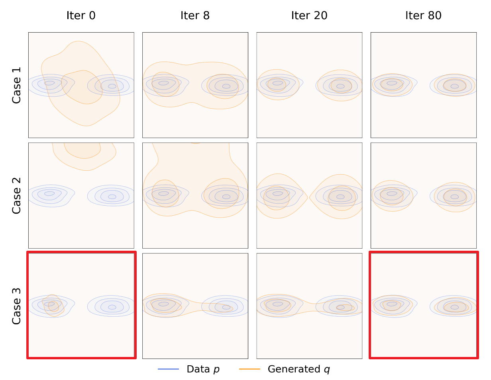

---

## Experiment) ImageNet $256\times256$ in **Latent** Space
#### Authors used Masked Autoencoder (**MAE**, pre-trained & ResNet-based) to compute loss on the **feature (latent)** space

### $\text{NFE}=1 \quad(\because f(\epsilon)\sim p_{\text{data}})$

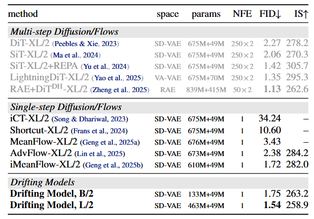

---

## Experiment) ImageNet $256\times256$ in **Pixel** Space

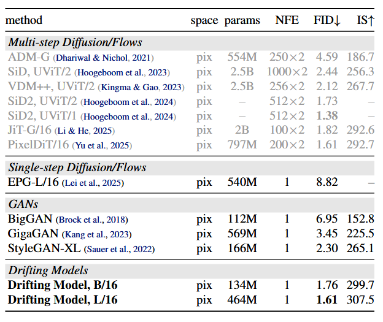

---

## Did **anti-symmetric** $\mathbf{V}_{p,q}$ work?

### If you recall, authors used $\mathbf{V}_{p,q}(\mathbf{x}) = \mathbf{V}_{p}^+(\mathbf{x}) - \mathbf{V}_{q}^-(\mathbf{x})$ 
### $\quad\quad\quad\quad\quad$ to satisfy $\mathbf{V}_{p,q}(\mathbf{x})=0\Rightarrow p=q$

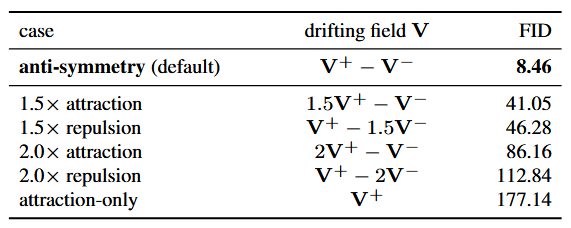

---

## Experiment) **Robotics** in $\text{NFE}=1$?
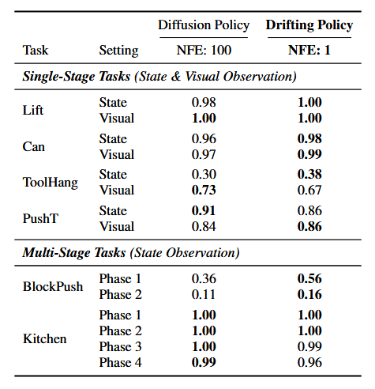

---

# Possible Direction : **NF** x Drifting Loss
### What if we replace DiT with **TarFlow (NF)**, get the **exact log-likelihood $\log p_\theta$** from NF, and use the **exact score $\nabla_\mathbf{x} \log p_\theta(\mathbf{x})$** as the $\mathbf{V}_{q}^-$?

### Original Drift 
### $\quad\mathbf{V}_{p,q}(\mathbf{x}) = \mathbf{V}_{p}^+(\mathbf{x})-\mathbf{V}_{q}^-(\mathbf{x})=\mathcal{K}(\mathbf{x}, \mathbf{y}^-, \mathbf{y}^+)\approx\text{Softmax}\left(\frac{-\Vert\mathbf{x}-\mathbf{y}\Vert}{\tau}\right)_{\mathbf{y}=\mathbf{y}^-,\mathbf{y}^+}$

### Drifting NF
### $\quad\mathbf{V}_{p,q}(\mathbf{x}) = \mathbf{V}_{p}^+(\mathbf{x})-\mathbf{V}_{q}^-(\mathbf{x})=\text{Softmax}\left(\frac{-\Vert\mathbf{x}-\mathbf{y}^+\Vert}{\tau}\right)-\lambda_{\text{NF}} \cdot \underbrace{\nabla_\mathbf{x} \log p_\theta(\mathbf{x})}_{\text{vs }\;\mathbf{y}^-\sim p_\theta}$

---

## [WIP] Toy Experiment 1 : Without Even Explicitly Training NF

### $\mathcal{L} = \mathcal{L}_{\text{drift}}$
#### $\text{s.t. } \mathcal{L}_{\text{drift}} = \mathbb{E}_{\boldsymbol{\epsilon}}\bigg[ \Big\Vert f_\theta(\boldsymbol{\epsilon}) - \text{sg}\left( f_\theta(\boldsymbol{\epsilon}) + \text{Softmax}\left(\frac{-\Vert f_\theta(\boldsymbol{\epsilon})-\mathbf{y}^+\Vert}{\tau}\right)- \nabla_\mathbf{x} \log p(f_\theta(\boldsymbol{\epsilon}))\right) \Big\Vert^2 \bigg]$

|Training Data|$i=600$|$i=2,000$|$i=16,000$|
|:-:|:-:|:-:|:-:|
|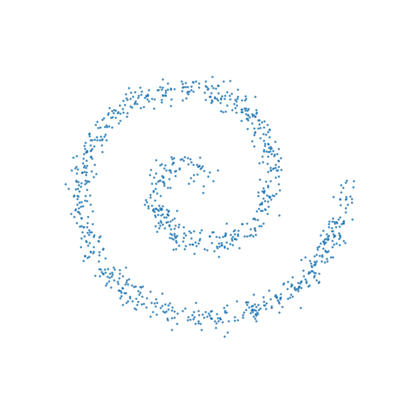|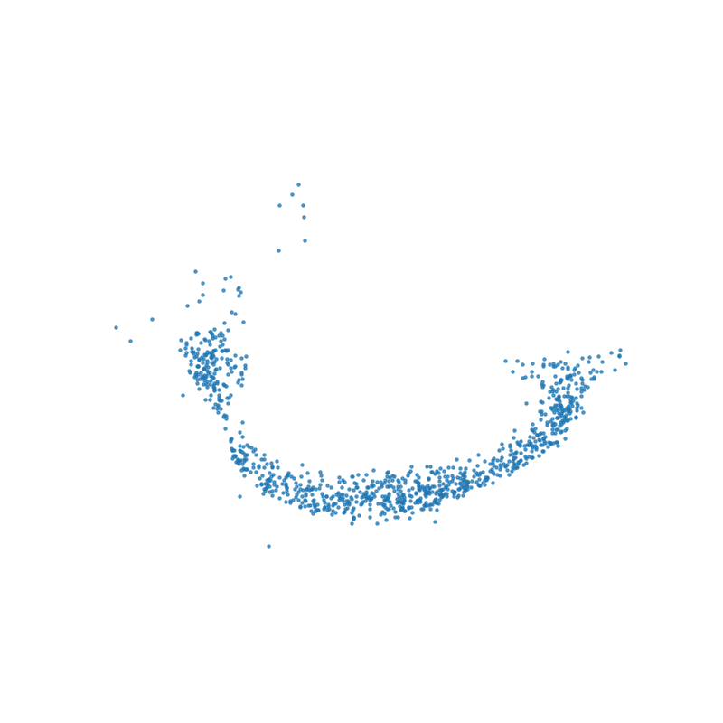|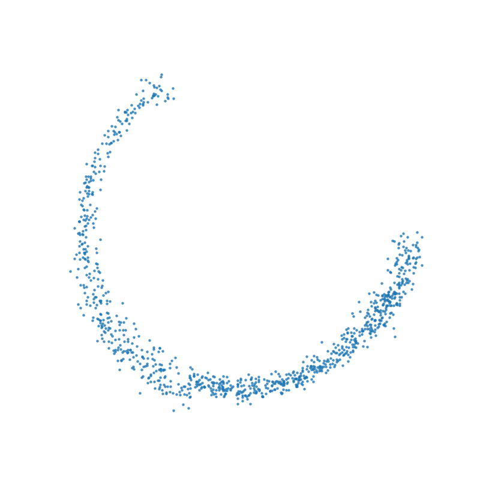|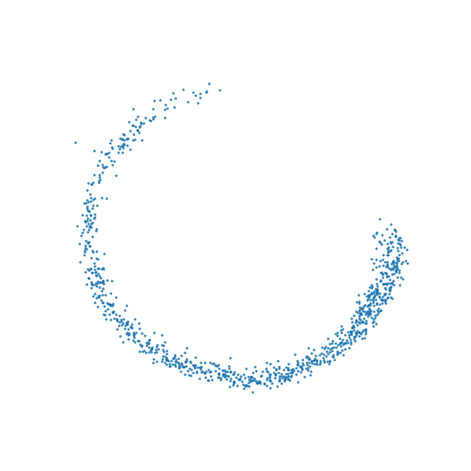|

#### Possible Solutions : Temperature Annealing

---

## [WIP] Toy Experiment 2 : Simultaneously Training NF and Drift

### $\mathcal{L} = \mathcal{L}_{\text{drift}} + \lambda \cdot \mathcal{L}_{\text{MLE\_NF}}$
### $\text{where } \mathcal{L}_{\text{MLE\_NF}}= \log p(f(x))-\log\left\vert\text{det}\frac{\partial f(x)}{\partial x}\right\vert$

|Training Data|$(\lambda=2)\;i=600$|$i=2,000$|$i=2,700$   (still running...)|
|:-:|:-:|:-:|:-:|
||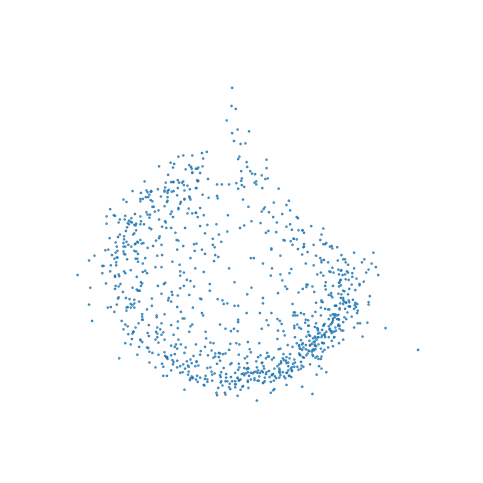|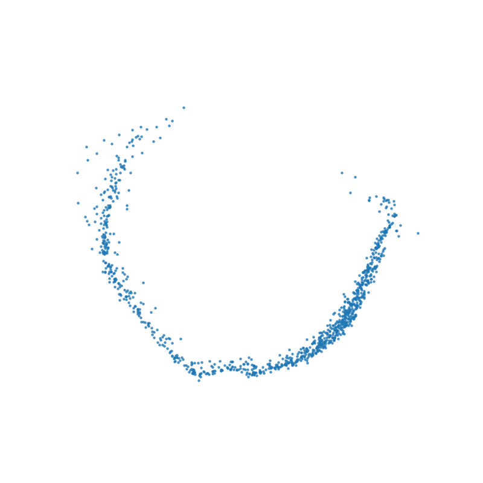|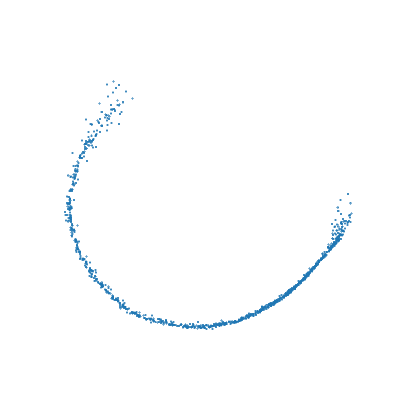|

#### Problem : Slower training

---

# Questions or thoughts

---

# Thank you.