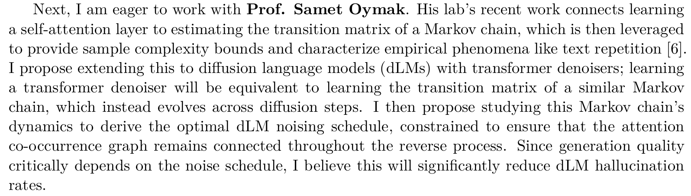

## 260830
- Takeaways
  - Take [Ashiq](#ashiq-umich-2025)'s strategy of proposing detailed ideas from faculties
  - Take [Heineman](#heineman-stanford-2025)'s strategy of suggesting multiple set of
    1. prior work
    2. unresolved question
    3. future agenda
  - Avoid [Loevlie](#loevlie-amsterdam-2025)'s career transition narrative

#### Ashiq, UMich 2025
- Similar to my situtation
  - One publication : workshop, under ICLR review
- Good strategy : PI specified suggestions     
  

#### Heineman, Stanford 2025
- Plenty research experience
- Ideas and questions driven from his experience
  - Applying to my case
    - I realized that sampling-time dynamics constitute an important computational axis in toy, class-structured settings such as modular addition.
    - However, the probe we used was less effective at explaining generalization in more realistic diffusion tasks, such as image generation.
    - This limitation led me to seek quantities more directly tied to the generative objective and the model’s distributional dynamics.
    - More broadly, it motivated my interest in understanding how diffusion models compute in richer, more realistic generative settings.

#### Loevlie, Amsterdam 2025
- Long story before ML (molecule, robotics...)
- What I learned from this...
  - Discard the previous **hook** mentioning SW engineering. 
  - Directly cast the **research question** such as...
    - How does a diffusion model organize its computation over the course of generation, and how do those internal dynamics give rise to generalization
    - What computational mechanisms allow generative models to transform learned distributions into coherent samples?
  - Then proceed with the research experience
    - I first encountered this question while studying algorithmic generalization in diffusion models...

  

## 260831

#### Cho, UMD 2025
- Pros
  - "Research Experience - Future Question" structure
- Cons
  - Do not stack conceptual terminologies in a single sentence.
    - Instead,
      - There is a problem s.t. ...
      - I addressed this issue with ...
      - Still, ... remains
      - Thus, I want to solve this with ...
  - Do not include personal narrative.
    - e.g.) Rejection from conference -> Development
  - Refrain from "I am interested in ..." type of sentence

#### Teoh, MIT 2025
- Pros
  - Briefly mentioning achievements
  - Showing interest in PI's recent talk 

#### Kirtania, UMich 2025
- Pros
- Cons
  - Not providing the thoughtful review on her accomplishments but just providing the venue.

  

## 260901
#### Wong, UPenn 2024
- Pros
  - Experience, knowledge, problem definition, future plan are all well described.

#### Song, CMU 2024
- Pros
  - Categorizing the works and incorporate them into the future goal.

  